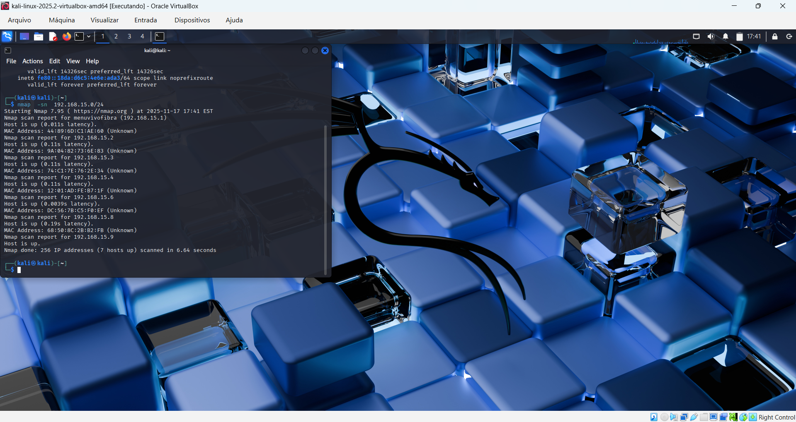
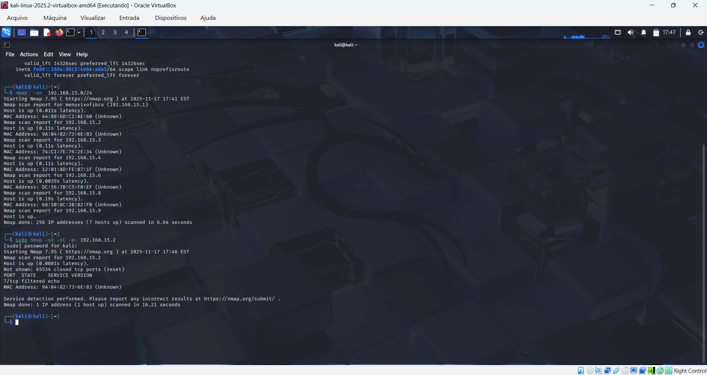
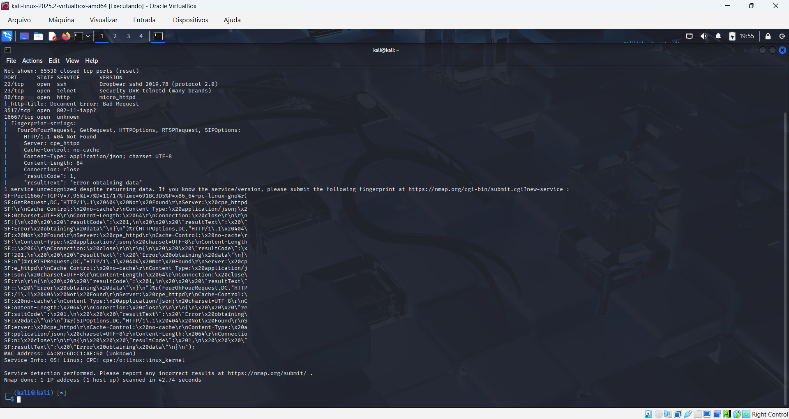
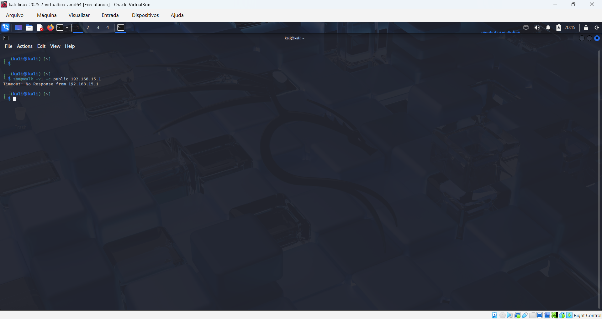
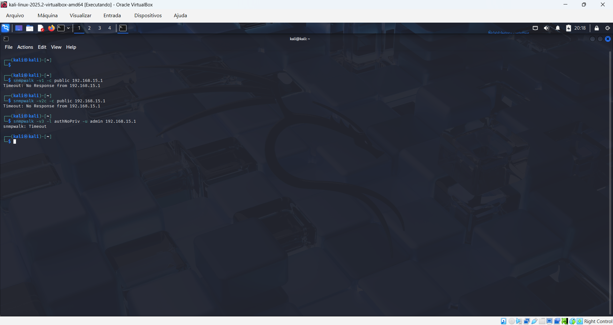
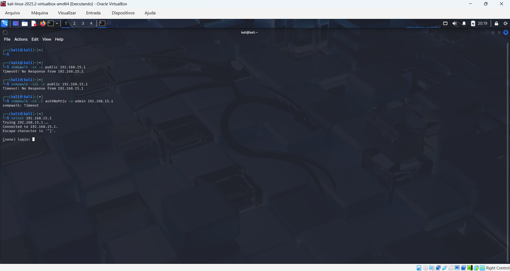
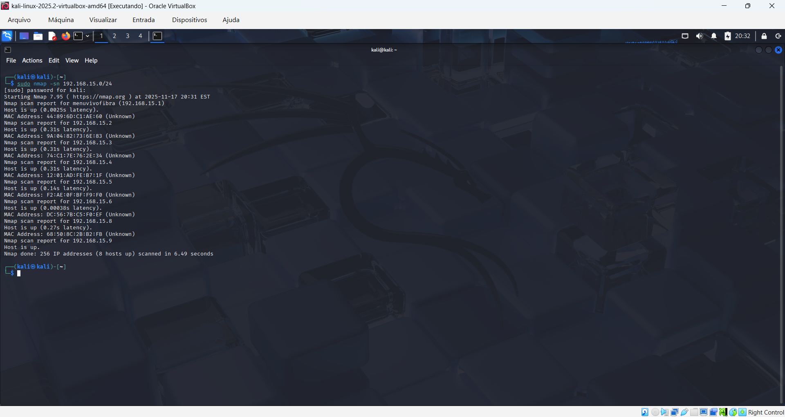
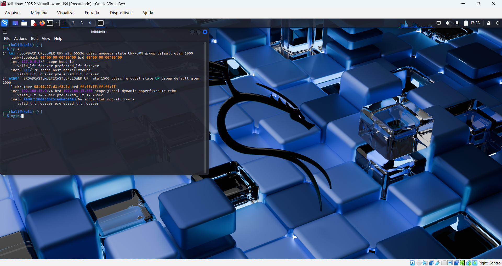

# 🛡 Auditoria Interna de Rede Doméstica – Projeto Completo

Este repositório apresenta um relatório **profissional**, **estruturado** e **com evidências reais**
de uma auditoria interna conduzida em uma rede doméstica, aplicando metodologias de
Segurança da Informação e práticas de Ethical Hacking.

Ideal para portfólio, processos seletivos e demonstrar domínio em:
- 🔍 Nmap (scans TCP, UDP, fingerprinting, OS detection)
- 🧪 Metodologia de auditoria não intrusiva
- 🖥 Análise de postura de segurança de dispositivos
- 🛡 Boas práticas em redes domésticas e IoT

---

## 📌 Objetivo da Auditoria

Avaliar a postura de segurança da rede doméstica, identificando:
- Dispositivos ativos
- Portas e serviços acessíveis
- Exposição indevida de protocolos
- Possíveis riscos e melhorias aplicáveis

Sem execução de exploits — auditoria **ética e não intrusiva**.

---

## 🧪 Metodologia Utilizada

Foram realizados testes ativos e passivos utilizando **Nmap**, conforme abaixo:

### 🔹 Descoberta de Hosts  
```
nmap -sn 10.0.0.0/24
```


---

### 🔹 Enumeração Completa TCP  
```
nmap -sC -sV -p- 10.0.0.X
```


---

### 🔹 Fingerprinting HTTP  
```
nmap -sV --script http-enum 10.0.0.X
```


---

### 🔹 Enumeração SNMP (v1 / v2c / v3)

  
  


---

### 🔹 Teste de Porta Telnet  


---

### 🔹 Coleta Local
Exemplo de coleta interna da estação Windows:


---

## 📡 Escopo da Auditoria

Dispositivos avaliados:

- Roteador (serviços internos SNMP, ISAKMP, SYSLOG)
- Notebook Windows
- Máquina Virtual Kali Linux
- Smartphones Android e iPhone
- Smart TV LG

Todos tiveram endereços mascarados no range `10.0.0.x`.

---

## 📄 Relatório Completo em PDF

O relatório técnico completo está disponível abaixo:

➡ **[📘 Relatorio_Auditoria_Rede_Interna.pdf](Relatorio_Auditoria_Rede_Interna.pdf)**

---

## ✅ Conclusão Geral

A rede doméstica apresentou uma **excelente postura de segurança**:

- Nenhuma exposição crítica detectada  
- Firewall ativo nos endpoints  
- Serviços internos do roteador **não expostos à LAN**  
- Smartphones com postura robusta  
- Smart TV sem portas abertas detectáveis  

---

## 🛡 Recomendações de Melhoria

- Manter firewalls ativos em todos os dispositivos  
- Atualizar firmware do roteador  
- Evitar habilitar ADB em celulares  
- Criar rede separada (guest/IoT)  
- Usar máquinas vulneráveis controladas (DVWA, Metasploitable) para estudo  

---

## 📁 Estrutura do Repositório

```
auditoria-rede-interna-github-pro/
├── README.md
├── Relatorio_Auditoria_Rede_Interna.pdf
└── evidencias/
    ├── 01-ip-config.png
    ├── 02-nmap-host-discovery.png
    ├── 03-nmap-tcp-full-scan.png
    ├── 04-nmap-http-fingerprint.png
    ├── 05-snmpwalk-v1.png
    ├── 06-snmpwalk-v2c.png
    ├── 07-snmpwalk-v3.png
    └── 08-telnet-open-port-23.png
```

---

## 👤 Autor

**George de Moura Marques Nóbrega**  
Projeto desenvolvido para fins educacionais e demonstração profissional.

---

## 🚀 Como contribuir ou adaptar

Você pode:
- adicionar mais hosts
- incluir scans automatizados com scripts NSE
- separar metodologia em `/docs`
- transformar este repositório em um case de portfólio

---

